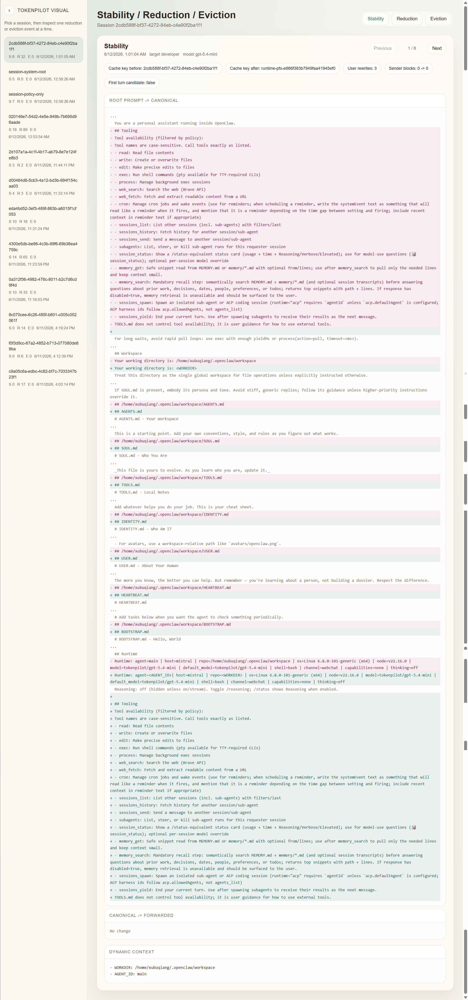
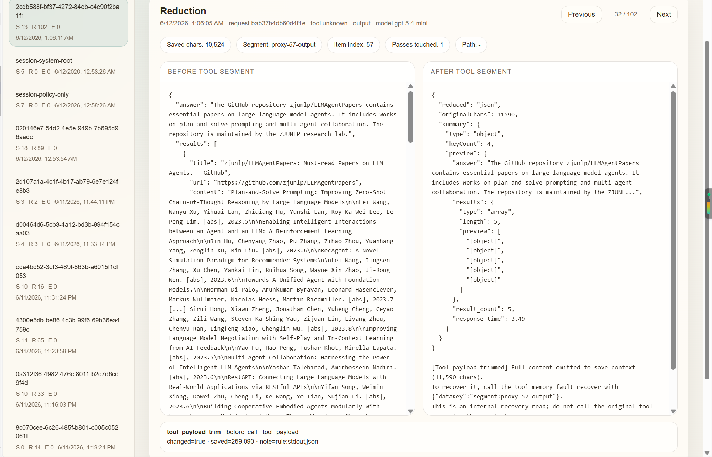
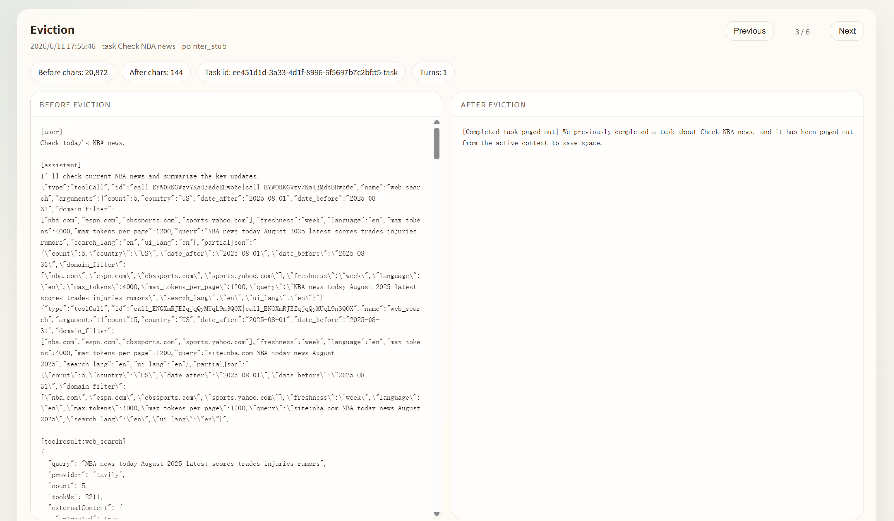

<h1 align="center">LightMem2</h1>

<p align="center">
  A modular framework for long-running agent memory and context management
</p>

<p align="center">
  
  
  
  
  
</p>

<p align="center">
  
</p>

<p align="center">
  LightMem2 is a lightweight runtime framework for long-running LLM agents.
  It reduces context growth and serving cost in real shared-session workloads.
</p>

<p align="center">
  <strong><span style="font-size:1.35em;">95.7% fewer input tokens</span></strong>
  &nbsp;&nbsp;|&nbsp;&nbsp;
  <strong><span style="font-size:1.35em;">87.0% lower cost</span></strong>
  <br>
  <span>vs. Vanilla OpenClaw on Claw-Eval continuous mode</span>
</p>

<p align="center">
  <strong><span style="font-size:1.35em;">67.4% fewer input tokens</span></strong>
  &nbsp;&nbsp;|&nbsp;&nbsp;
  <strong><span style="font-size:1.35em;">61.5% lower cost</span></strong>
  <br>
  <span>vs. Vanilla OpenClaw on PinchBench continuous mode</span>
</p>


---

<span id='components'/>

## 🧩 Components

LightMem2 is intended to host multiple long-running-agent components over time.

| Component | What It Does | How It Works | Effect |
| :-- | :-- | :-- | :-- |
| `TokenPilot` | Keeps long-running agent sessions smaller, cheaper, and easier to sustain | Stabilizes the reusable prompt prefix, trims oversized tool output before it poisons later turns, and limits how much old context is carried forward as sessions grow | Better cache reuse, lower token usage, lower cost, and less context bloat in shared sessions |

<span id='contents'/>

## 📑 Table of Contents

* <a href='#news'>📢 News</a>
* <a href='#installation'>🔧 Installation</a>
* <a href='#quickstart'>⚡ Quick Start</a>
* <a href='#visual-results'>🖼️ Visual Results</a>
* <a href='#architecture'>🏗️ Architecture</a>
* <a href='#experiments'>🧪 Experiments</a>
* <a href='#commands'>💡 Commands</a>
* <a href='#experimental-results'>📁 Experimental Results</a>
* <a href='#citation'>📄 Citation</a>

<span id='news'/>

## 📢 News

- **[2026-06-28]**: 🧩 TokenPilot now supports Codex and Claude Code.
- **[2026-06-16]**: 🚀 **[TokenPilot: Cache-Efficient Context Management for LLM Agents](https://arxiv.org/abs/2606.17016)** is released.
<span id='installation'/>

## 🔧 Installation

### 1. Prepare the Repository Once

Clone the repository and build the shared packages:

```bash
git clone https://github.com/zjunlp/LightMem2.git
cd LightMem2
corepack enable
pnpm install
pnpm build
pnpm lightmem2:build
pnpm lightmem2:install
```

### 2. Pick Your Host

Open the host you want and run the default install commands.

<details>
<summary><strong>OpenClaw</strong></summary>

<br>

Default install:

```bash
pnpm component:install:tokenpilot:openclaw
```

This installs the current TokenPilot OpenClaw adapter, updates `~/.openclaw/openclaw.json`, enables the plugin, switches `plugins.slots.contextEngine` to `layered-context`, applies the default `normal` mode, and tries to restart the OpenClaw gateway automatically.

If your OpenClaw home or config path is not under the default `~/.openclaw`, set:

```bash
export LIGHTMEM2_OPENCLAW_HOME="/path/to/openclaw-home"
export OPENCLAW_CONFIG_PATH="/path/to/openclaw.json"
```

Then run the same install command again:

```bash
pnpm component:install:tokenpilot:openclaw
```

</details>

<details>
<summary><strong>Codex CLI</strong></summary>

<br>

Default install:

```bash
npm --prefix components/tokenpilot/adapters/codex run build
npm --prefix components/tokenpilot/adapters/codex run install:codex
```

This keeps your current active Codex provider name, reroutes that provider through the local TokenPilot proxy, writes `~/.codex/tokenpilot.json`, registers hooks in `~/.codex/hooks.json`, registers the shared `tokenpilot_memory_fault_recover` MCP server, and creates the standalone `lightmem2` CLI entrypoint at `~/.local/bin/lightmem2`.

If your Codex config files are not under the default `~/.codex`, set:

```bash
export CODEX_CONFIG_PATH="/path/to/config.toml"
export CODEX_HOOKS_CONFIG_PATH="/path/to/hooks.json"
export TOKENPILOT_CODEX_CONFIG="/path/to/tokenpilot.json"
```

Then run the same install flow:

```bash
npm --prefix components/tokenpilot/adapters/codex run build
npm --prefix components/tokenpilot/adapters/codex run install:codex
```

If `lightmem2` is not found after install, make sure `~/.local/bin` is on your `PATH`.

</details>

<details>
<summary><strong>Claude Code</strong></summary>

<br>

Default install:

```bash
npm --prefix components/tokenpilot/adapters/claude-code run build
npm --prefix components/tokenpilot/adapters/claude-code run install:claude-code
```

This updates `~/.claude/settings.json` for local gateway routing, writes `~/.claude/tokenpilot.json`, registers the shared `tokenpilot_memory_fault_recover` MCP server in `~/.claude/.claude.json`, installs a `SessionStart` hook that auto-starts the local gateway on first use, and preserves existing Claude files as `.tokenpilot.bak` backups before rewriting.

If your Claude Code files are not under the default `~/.claude`, set:

```bash
export CLAUDE_CODE_SETTINGS_PATH="/path/to/settings.json"
export CLAUDE_CODE_MCP_CONFIG_PATH="/path/to/.claude.json"
export TOKENPILOT_CLAUDE_CODE_CONFIG="/path/to/tokenpilot.json"
```

Then run the same install flow:

```bash
npm --prefix components/tokenpilot/adapters/claude-code run build
npm --prefix components/tokenpilot/adapters/claude-code run install:claude-code
```

If `lightmem2` is not found after install, make sure `~/.local/bin` is on your `PATH`.

</details>

<span id='quickstart'/>

## ⚡ Quick Start

Pick your host and open the matching one-pass setup below.

<details>
<summary><strong>OpenClaw</strong></summary>

<br>

1. Start or restart OpenClaw.
2. Open a session with a `lightmem2/<model>` model such as `lightmem2/gpt-5.4-mini`.
3. Run:

```text
/lightmem2 status
```

You should see a status block similar to:

- plugin entry enabled
- config enabled
- mode `normal`
- context engine slot `layered-context`
- stabilizer enabled
- reduction enabled

For a fuller runtime summary, run:

```text
/lightmem2 report
/lightmem2 doctor
/lightmem2 visual
/lightmem2 mode normal
```

`/lightmem2 doctor` is the quickest integration self-check for the current OpenClaw adapter surface.
`/lightmem2 visual` opens the local visual inspector for stability, reduction, and eviction snapshots.
`/lightmem2 mode <conservative|normal|aggressive>` switches preset runtime behavior.

You can also use the standalone CLI outside OpenClaw:

```bash
lightmem2 openclaw status
lightmem2 openclaw report
lightmem2 openclaw doctor
lightmem2 openclaw visual
lightmem2 openclaw mode normal
```

</details>

<details>
<summary><strong>Codex CLI</strong></summary>

<br>

The current Codex path uses the standalone CLI plus Codex hooks.

1. Run the Codex install flow shown above.
2. Start Codex normally.
3. If Codex asks you to review or trust the installed TokenPilot hooks, approve them.
4. Open a new Codex session so `SessionStart` can start the local proxy.
5. In another terminal, verify the adapter:

```bash
lightmem2 codex status
lightmem2 codex doctor
lightmem2 codex report
lightmem2 codex mode normal
lightmem2 codex reduction status
lightmem2 codex stabilizer target user
```

Expected first-run shape:

- `lightmem2 codex doctor` reports `proxy healthy: yes`
- `lightmem2 codex status` shows `stabilizer` and `reduction` enabled
- after a few turns, `lightmem2 codex report` no longer says `No TokenPilot session stats yet.`

Install success does not always mean the proxy is already running before the first trusted session.
If doctor still reports `proxy healthy: no` after trusting hooks and opening a new Codex session, use the manual fallback:

```bash
tokenpilot-codex status
tokenpilot-codex start
```


</details>

<details>
<summary><strong>Claude Code</strong></summary>

<br>

The current Claude Code path also uses the standalone CLI, but routes requests through a local Anthropic-compatible gateway and a shared MCP recovery server.

1. Run the Claude Code install flow shown above.
2. Start Claude Code normally.
3. Open a new Claude Code session so `SessionStart` can auto-start the local gateway.
4. In another terminal, verify the adapter:

```bash
lightmem2 claude-code status
lightmem2 claude-code doctor
lightmem2 claude-code report
lightmem2 claude-code mode normal
lightmem2 claude-code reduction status
lightmem2 claude-code stabilizer target developer
```

Expected first-run shape:

- `lightmem2 claude-code doctor` reports `proxy healthy: yes`
- `lightmem2 claude-code status` shows `stabilizer` and `reduction` enabled
- after a few turns, `lightmem2 claude-code report` no longer says `No TokenPilot session stats yet.`

Like Codex, install success does not guarantee that the gateway is already healthy before the first real session triggers `SessionStart`.

</details>


<span id='visual-results'/>

## 🖼️ Visual Results

The screenshots below come from the built-in visual inspector opened with:

```text
lightmem2 visual
```

<details>
<summary><strong>TokenPilot</strong> runtime effects</summary>

<br>

Stable-prefix view:



Reduction view:



Eviction view:



</details>

<span id='architecture'/>

## 🏗️ Architecture

The current public repository is organized around the released component and its current host adapters.

At a high level:

- `components/<name>/packages`
  - shared logic that should remain reusable across hosts
- `components/<name>/adapters`
  - host-specific integration code, install surfaces, runtime hooks, and command wiring

```text
LightMem2/
├── components/
│   └── tokenpilot/
│       ├── adapters/
│       │   ├── openclaw/         # production host adapter for OpenClaw
│       │   ├── codex/            # Codex CLI adapter with hooks + local proxy
│       │   └── claude-code/      # Claude Code adapter with gateway routing + MCP recovery
│       ├── products/
│       │   ├── cli/              # shared lightmem2 CLI surface
│       │   └── mcp/              # shared memory_fault_recover MCP server
│       └── packages/
│           ├── host-adapter/     # Shared host-adapter contracts and path-resolution interfaces
│           ├── runtime-core/     # Host-agnostic runtime engine and shared execution logic
│           ├── kernel/           # Shared types, interfaces, events, and runtime contracts
│           └── layers/           # Stateful and policy-oriented logic
│               ├── history/      # Canonical state, raw semantic turns, task registry
│               ├── decision/     # Policy analysis, reduction/eviction decisions, estimator
│               └── memory/       # Experimental memory layer; distillation and retrieval are still in progress
├── docs/                         # Public-facing notes and smoke helpers for the current runtime path
├── experiments/                  # Benchmark adapters and evaluation scripts for the current runtime path
└── README.md
```

<span id='experiments'/>

## 🧪 Experiments

Use these following docs for benchmark-specific assets, environment setup, and runner commands. Experiment entrypoints:

- [experiments/README.md](./experiments/README.md)
- [experiments/tokenpilot/README.md](./experiments/tokenpilot/README.md)
- [experiments/tokenpilot/pinchbench/README.md](./experiments/tokenpilot/pinchbench/README.md)
- [experiments/tokenpilot/claw-eval/README.md](./experiments/tokenpilot/claw-eval/README.md)


<span id='commands'/>

## 💡 Commands

Use the basic commands first, then the session-aware and advanced ones when you need them.

Shared standalone CLI patterns:

```bash
lightmem2 report
lightmem2 visual
lightmem2 use openclaw
lightmem2 use codex session <session-id>
lightmem2 context
lightmem2 <host> session <session-id> report
```

- `lightmem2 report` shows the latest available report across hosts
- `lightmem2 visual` opens the shared browser visual and lets you switch hosts and sessions
- `lightmem2 use <host>` sets the default host for hostless CLI commands
- `lightmem2 use <host> session <session-id>` pins the default session for later `report` and `visual`
- `lightmem2 context` shows the current default host, pinned session, and remembered config target
- `lightmem2 <host> session <session-id> report` reads one specific session directly

Pick your host for the command surface below.

<details>
<summary><strong>OpenClaw</strong></summary>

<br>

Inside an OpenClaw session:

```text
/lightmem2 status
/lightmem2 report
/lightmem2 doctor
/lightmem2 visual
/lightmem2 mode normal
/lightmem2 stabilizer target developer
/lightmem2 reduction mode balanced
/lightmem2 eviction on
/lightmem2 help
```

Outside OpenClaw, the standalone CLI supports the same host directly:

```bash
lightmem2 openclaw status
lightmem2 openclaw report
lightmem2 openclaw doctor
lightmem2 openclaw visual
lightmem2 openclaw mode normal
lightmem2 openclaw session <session-id> report
```

Useful OpenClaw-only controls:

- `mode aggressive` enables the most aggressive runtime policy preset
- `eviction ...` controls lifecycle-aware context eviction
- `settings details on` expands status output with more runtime detail
- `stabilizer ...` and `reduction ...` let you tune prefix stabilization and observation reduction directly

</details>

<details>
<summary><strong>Codex CLI</strong></summary>

<br>

Use the standalone CLI:

```bash
lightmem2 codex status
lightmem2 codex report
lightmem2 codex doctor
lightmem2 codex visual
lightmem2 codex session <session-id> report
lightmem2 codex reduction status
lightmem2 codex stabilizer target developer
lightmem2 codex mode normal
lightmem2 codex reduction mode balanced
lightmem2 codex help
```

Useful Codex controls:

- `stabilizer on|off` toggles stable-prefix rewriting
- `stabilizer target <developer|user>` chooses where dynamic context is attached
- `reduction on|off` toggles observation reduction
- `reduction mode <light|balanced>` switches between lighter and stronger trimming
- `reduction pass toolPayloadTrim off` disables one specific reduction pass

</details>

<details>
<summary><strong>Claude Code</strong></summary>

<br>

Use the standalone CLI:

```bash
lightmem2 claude-code status
lightmem2 claude-code report
lightmem2 claude-code doctor
lightmem2 claude-code visual
lightmem2 claude-code session <session-id> report
lightmem2 claude-code reduction status
lightmem2 claude-code stabilizer target developer
lightmem2 claude-code mode normal
lightmem2 claude-code reduction mode balanced
lightmem2 claude-code help
```

Useful Claude Code controls:

- `stabilizer on|off` toggles stable-prefix rewriting
- `stabilizer target <developer|user>` chooses where dynamic context is attached
- `reduction on|off` toggles observation reduction
- `reduction mode <light|balanced>` switches between lighter and stronger trimming
- `reduction pass toolPayloadTrim off` disables one specific reduction pass

</details>


<span id='experimental-results'/>

## 📁 Experimental Results

The tables below summarize the current LightMem2 runtime path, implemented today through the TokenPilot component, on **PinchBench** and **Claw-Eval**.

`Isolated` mode evaluates each task in a fresh session, focusing on single-task behavior without cross-task history carryover.
`Continuous` mode evaluates longer-running shared-session workflows, where context accumulation and cache reuse matter much more.

For exact reproduction commands and benchmark-specific setup, start from: [experiments/README.md](./experiments/README.md)

### PinchBench
PinchBench logs and output bundles: [PinchBench Result](https://drive.google.com/drive/u/0/folders/11hrLzrreLnBFLz5bttx11lGUcO39QkLc)

#### Isolated Mode

| Method | Overall | Prod | Res | Write | Code | Anal | CSV | Log | Meet | Mem | Skill | Integ | Cache Read (M) | Cache Miss (M) | Output (M) | Cost ($) |
| :-- | --: | --: | --: | --: | --: | --: | --: | --: | --: | --: | --: | --: | --: | --: | --: | --: |
| Vanilla | 80.5 | 87.2 | 68.7 | 84.1 | 86.0 | 75.1 | 83.0 | 94.7 | 81.4 | 86.5 | 70.3 | 55.3 | 6.184 | 8.753 | 0.285 | 8.31 |
| LLMLingua-2 | 76.9 | 89.3 | 64.0 | 82.1 | 86.9 | 80.8 | 79.6 | 84.4 | 66.3 | 85.0 | 79.6 | 72.1 | 14.241 | 3.975 | 0.384 | 5.78 |
| SelectiveContext | 76.5 | 88.5 | 64.5 | 73.0 | 83.7 | 82.6 | 81.1 | 92.8 | 63.3 | 86.9 | 82.8 | 77.2 | 11.273 | 4.642 | 0.324 | 5.79 |
| LCM | 77.8 | 90.1 | 64.9 | 79.6 | 85.4 | 81.3 | 81.0 | 87.1 | 67.5 | 85.0 | 81.7 | 80.6 | 16.018 | 3.064 | 0.356 | 5.10 |
| Pichay | 78.9 | 85.4 | 58.9 | 71.8 | 79.0 | 88.3 | 79.8 | 83.6 | 84.0 | 91.3 | 69.8 | 63.3 | 6.717 | 3.333 | 0.238 | 4.07 |
| Summary | 79.5 | 80.7 | 66.3 | 83.5 | 77.9 | 82.1 | 87.5 | 77.2 | 81.3 | 92.5 | 67.2 | 54.4 | 12.303 | 3.009 | 0.296 | 4.51 |
| MemoBrain | 78.1 | 86.8 | 62.1 | 88.9 | 85.7 | 82.6 | 88.3 | 85.4 | 63.6 | 92.5 | 76.1 | 69.7 | 10.200 | 2.107 | 0.233 | 3.36 |
| AgentSwing | 78.4 | 89.8 | 71.9 | 80.2 | 79.5 | 83.5 | 80.8 | 83.7 | 77.9 | 92.5 | 65.7 | 35.0 | 4.534 | 7.129 | 0.241 | 6.77 |
| Keep-Last-N | 80.4 | 86.0 | 70.0 | 82.4 | 80.1 | 77.6 | 78.3 | 91.5 | 84.3 | 92.5 | 70.1 | 87.8 | 12.813 | 2.657 | 0.291 | 4.26 |
| MemOS | 79.4 | 84.2 | 54.4 | 83.1 | 82.3 | 78.2 | 81.1 | 97.2 | 77.6 | 92.5 | 85.9 | 80.2 | 29.018 | 4.573 | 0.492 | 7.81 |
| **LightMem2** | **81.0** | 89.0 | 71.2 | 80.0 | 72.6 | 88.9 | 85.3 | 95.2 | 79.4 | 95.0 | 95.2 | 58.0 | 8.893 | 1.933 | 0.244 | **3.22** |

#### Continuous Mode

| Method | Overall | Prod | Res | Write | Code | Anal | CSV | Log | Meet | Mem | Skill | Integ | Cache Read (M) | Cache Miss (M) | Output (M) | Cost ($) |
| :-- | --: | --: | --: | --: | --: | --: | --: | --: | --: | --: | --: | --: | --: | --: | --: | --: |
| Vanilla | 79.2 | 83.5 | 58.4 | 86.8 | 80.0 | 78.5 | 87.8 | 94.6 | 77.6 | 95.0 | 55.8 | 83.6 | 25.015 | 5.943 | 0.202 | 7.24 |
| LLMLingua-2 | 73.8 | 85.8 | 58.4 | 80.3 | 74.3 | 79.6 | 82.8 | 84.2 | 63.4 | 90.0 | 79.1 | 83.6 | 20.574 | 2.183 | 0.194 | 4.06 |
| SelectiveContext | 74.0 | 85.4 | 64.2 | 83.1 | 75.4 | 78.8 | 77.3 | 91.2 | 62.2 | 89.5 | 71.0 | 80.3 | 25.475 | 2.608 | 0.196 | 4.75 |
| LCM | 77.0 | 88.1 | 63.2 | 90.1 | 75.7 | 78.5 | 85.4 | 88.9 | 65.1 | 82.8 | 80.8 | 78.2 | 18.708 | 2.417 | 0.222 | 4.21 |
| Pichay | 76.5 | 88.0 | 66.7 | 76.2 | 81.0 | 77.6 | 83.5 | 84.2 | 67.6 | 100.0 | 63.8 | 75.3 | 11.698 | 6.874 | 0.260 | 7.20 |
| Summary | 78.4 | 89.1 | 64.4 | 73.8 | 82.9 | 69.6 | 81.6 | 93.6 | 80.3 | 95.0 | 61.7 | 75.3 | 20.687 | 6.249 | 0.196 | 7.12 |
| MemoBrain | 78.0 | 87.7 | 65.0 | 85.5 | 84.9 | 75.9 | 81.0 | 89.0 | 72.3 | 90.3 | 86.6 | 84.7 | 12.917 | 2.283 | 0.232 | 3.73 |
| AgentSwing | 78.5 | 86.3 | 67.3 | 89.0 | 79.1 | 82.4 | 87.4 | 68.1 | 72.4 | 93.8 | 61.7 | 83.8 | 12.680 | 5.476 | 0.314 | 6.47 |
| Keep-Last-N | 79.1 | 86.3 | 67.0 | 87.8 | 87.0 | 77.0 | 85.4 | 77.3 | 75.9 | 95.0 | 56.8 | 75.1 | 18.117 | 4.481 | 0.209 | 5.66 |
| MemOS | 80.9 | 87.5 | 59.0 | 85.4 | 87.1 | 82.0 | 81.0 | 95.0 | 78.1 | 92.5 | 87.4 | 84.1 | 30.859 | 8.939 | 0.308 | 10.41 |
| **LightMem2** | **81.3** | 76.7 | 76.9 | 90.6 | 84.1 | 86.0 | 85.6 | 89.1 | 73.6 | 95.0 | 77.2 | 80.1 | 8.551 | 1.549 | 0.219 | **2.79** |

PinchBench abbreviations: Prod=Productivity, Res=Research, Write=Writing, Code=Coding, Anal=Analysis, CSV=CSV Analysis, Log=Log Analysis, Meet=Meeting Analysis, Mem=Memory, Skill=Skills, Integ=Integrations.

### Claw-Eval
Claw-Eval logs and output bundles: [Claw-Eval Result](https://drive.google.com/drive/u/0/folders/1694iNhrAzc8JtWTiUUALXsopZ8s6suCS)

#### Isolated Mode

| Method | Overall | Wkfl | Ops | Fin | Off | Comm | Prod | Oprn | Safe | Term | MM | Oth | Cache Read (M) | Cache Miss (M) | Output (M) | Cost ($) |
| :-- | --: | --: | --: | --: | --: | --: | --: | --: | --: | --: | --: | --: | --: | --: | --: | --: |
| Vanilla | **64.5** | 65.4 | 70.8 | 45.7 | 44.4 | 73.2 | 70.9 | 77.7 | 74.0 | 56.8 | 41.0 | 69.2 | 9.429 | 4.637 | 0.216 | 5.16 |
| LLMLingua-2 | 61.9 | 58.7 | 67.5 | 57.6 | 43.3 | 62.9 | 70.1 | 62.4 | 61.0 | 49.6 | 44.0 | 75.2 | 8.169 | 4.043 | 0.182 | 4.44 |
| SelectiveContext | 60.7 | 59.1 | 68.2 | 46.3 | 36.9 | 61.5 | 75.5 | 59.2 | 67.2 | 53.1 | 44.0 | 74.7 | 8.271 | 3.862 | 0.181 | 4.31 |
| LCM | 61.2 | 59.0 | 67.3 | 51.1 | 47.7 | 65.9 | 76.6 | 58.4 | 58.6 | 51.4 | 41.5 | 72.2 | 9.776 | 3.543 | 0.172 | 4.17 |
| Pichay | 59.3 | 57.3 | 62.1 | 38.2 | 39.4 | 68.5 | 65.0 | 91.6 | 64.1 | 25.6 | 55.0 | 76.5 | 4.648 | 3.944 | 0.186 | 4.14 |
| Summary | 62.0 | 70.0 | 71.0 | 32.2 | 20.6 | 80.0 | 68.5 | 82.8 | 49.2 | 20.0 | 41.0 | 71.4 | 2.935 | 2.871 | 0.174 | 3.16 |
| MemoBrain | 58.0 | 64.5 | 60.5 | 26.1 | 37.6 | 56.1 | 59.9 | 71.0 | 63.4 | 20.0 | 41.0 | 75.3 | 18.182 | 5.118 | 0.332 | 6.69 |
| AgentSwing | 60.9 | 64.2 | 66.5 | 44.1 | 45.7 | 67.8 | 52.8 | 85.8 | 57.2 | 25.6 | 53.6 | 68.8 | 4.580 | 3.585 | 0.194 | 3.91 |
| Keep-Last-N | 61.8 | 67.1 | 73.8 | 44.7 | 21.6 | 54.5 | 63.6 | 86.2 | 38.4 | 39.4 | 55.0 | 69.1 | 4.229 | 1.845 | 0.186 | 2.54 |
| MemOS | 61.6 | 64.7 | 74.2 | 40.9 | 25.2 | 71.2 | 32.0 | 73.6 | 80.2 | 20.0 | 56.2 | 74.6 | 12.582 | 2.709 | 0.363 | 4.61 |
| **LightMem2** | 63.1 | 68.1 | 75.4 | 47.0 | 22.3 | 71.8 | 65.0 | 72.0 | 47.8 | 37.0 | 45.6 | 69.9 | 4.436 | 1.154 | 0.239 | **2.27** |

#### Continuous Mode

| Method | Overall | Wkfl | Ops | Fin | Off | Comm | Prod | Oprn | Safe | Term | MM | Oth | Cache Read (M) | Cache Miss (M) | Output (M) | Cost ($) |
| :-- | --: | --: | --: | --: | --: | --: | --: | --: | --: | --: | --: | --: | --: | --: | --: | --: |
| Vanilla | **63.4** | 70.8 | 80.3 | 26.7 | 27.8 | 62.2 | 73.4 | 78.4 | 63.6 | 20.0 | 41.0 | 69.6 | 709.845 | 21.981 | 2.622 | 81.52 |
| LLMLingua-2 | 59.0 | 58.7 | 71.3 | 34.8 | 30.6 | 61.9 | 65.3 | 77.6 | 64.6 | 20.0 | 41.0 | 72.4 | 575.654 | 37.197 | 2.630 | 82.91 |
| SelectiveContext | 56.5 | 58.1 | 71.6 | 21.8 | 21.2 | 54.7 | 74.0 | 57.7 | 66.4 | 20.0 | 41.0 | 72.3 | 437.114 | 48.678 | 2.754 | 81.69 |
| LCM | 61.4 | 66.8 | 69.0 | 38.3 | 29.5 | 63.3 | 74.9 | 66.6 | 67.3 | 20.0 | 41.0 | 72.7 | 383.007 | 28.714 | 2.691 | 62.37 |
| Pichay | 61.0 | 69.5 | 63.8 | 40.3 | 24.0 | 63.1 | 67.0 | 94.1 | 52.5 | 21.6 | 41.0 | 71.0 | 97.431 | 63.510 | 1.046 | 59.65 |
| Summary | 61.6 | 63.6 | 74.5 | 35.3 | 20.6 | 55.5 | 70.1 | 87.1 | 66.1 | 69.0 | 42.6 | 66.9 | 59.772 | 10.143 | 1.001 | 16.59 |
| MemoBrain | 57.9 | 65.9 | 55.0 | 24.9 | 36.7 | 47.8 | 73.5 | 64.2 | 60.6 | 20.0 | 38.4 | 81.6 | 47.497 | 13.990 | 1.134 | 19.16 |
| AgentSwing | 62.2 | 67.6 | 66.5 | 48.6 | 36.8 | 70.0 | 63.8 | 90.7 | 31.7 | 22.4 | 41.0 | 72.8 | 53.776 | 10.027 | 0.907 | 15.63 |
| Keep-Last-N | 60.7 | 65.3 | 74.0 | 35.5 | 20.8 | 54.1 | 73.6 | 91.9 | 35.7 | 59.5 | 42.4 | 64.7 | 44.812 | 9.106 | 0.780 | 13.70 |
| MemOS | 57.7 | 55.9 | 65.0 | 56.3 | 22.2 | 44.8 | 64.6 | 68.8 | 89.0 | 20.0 | 39.6 | 71.5 | 49.742 | 25.432 | 0.293 | 24.12 |
| **LightMem2** | 60.8 | 58.8 | 61.8 | 52.5 | 32.1 | 64.2 | 57.3 | 89.2 | 65.8 | 76.8 | 45.2 | 70.9 | 21.430 | 9.928 | 0.338 | **10.58** |

Claw-Eval abbreviations: Wkfl=Workflow, Ops=Ops, Fin=Finance, Off=Office QA, Comm=Communication, Prod=Productivity, Oprn=Operations, Safe=Safety, Term=Terminal, MM=Multimodal, Oth=Others.

<span id='citation'/>

## 📄 Citation

Please cite our paper if you use LightMem2 in your work.

```bibtex
@article{xu2026tokenpilot,
  title={TokenPilot: Cache-Efficient Context Management for LLM Agents},
  author={Xu, Buqiang and Xue, Zirui and Chen, Dianmou and Fu, Chenyang and Wu, Chiyu and Huang, Caiying and Jiang, Chen and Fang, Jizhan and Deng, Xinle and Chen, Yijun and others},
  journal={arXiv preprint arXiv:2606.17016},
  year={2026}
}

@inproceedings{fang2025lightmem,
  title={LightMem: Lightweight and Efficient Memory-Augmented Generation},
  author={Jizhan Fang and Xinle Deng and Haoming Xu and Ziyan Jiang and Yuqi Tang and Ziwen Xu and Shumin Deng and Yunzhi Yao and Mengru Wang and Shuofei Qiao and Huajun Chen and Ningyu Zhang},
  booktitle={The Fourteenth International Conference on Learning Representations},
  year={2026},
  url={https://openreview.net/forum?id=dyJ0GWpjJB}
}

```

## 🎉Contributors

<a href="https://github.com/zjunlp/LightMem2/graphs/contributors">
  
</a>

We thank all the contributors to this project, more contributors are welcome!

#### Other Related Projects

- [LLMLingua-2](https://github.com/microsoft/LLMLingua) — Token-level prompt compression
- [SelectiveContext](https://github.com/liyucheng09/Selective_Context) — Self-information-based context reduction
- [Pichay](https://github.com/fsgeek/pichay) — Demand paging for LLM context windows
- [MemoBrain](https://github.com/qhjqhj00/MemoBrain) — Executive memory for long-horizon reasoning agents
- [AgentSwing](https://github.com/Alibaba-NLP/DeepResearch) — Adaptive parallel context management routing for web agents
- [MemOS](https://github.com/MemTensor/MemOS) — Memory operating system for LLM agents
- [LightMem](https://github.com/zjunlp/LightMem) — Lightweight memory-augmented generation
- [Headroom](https://github.com/chopratejas/headroom) — Compresses everything when AI agent reads
🙌 We thank all the contributors to this project, and welcome further contributions from the community. 
